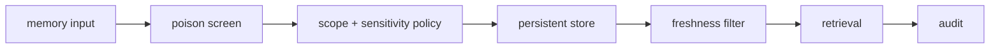

# Architecture

## Components

### Ingress policy
Screens incoming memories and records provenance, scope, sensitivity, and expiry.

### Persistent store
SQLite stores memory state and the audit trail.

### Retrieval policy
Filters by scope, allowed sensitivity, validity, and TTL before returning memories.

### Forgetting/supersession
Invalidates obsolete records and writes replacements without silently erasing the audit history.

## Design principle

An agent should remember only what it is authorized to retain and retrieve only what is still valid for the current scope.
